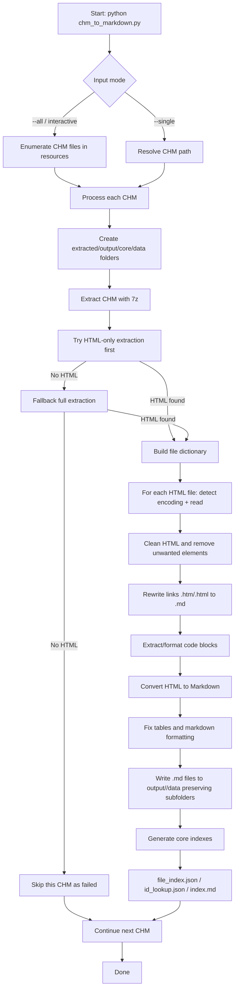

# CHM to Markdown Converter

A Python utility for converting Compiled HTML Help (CHM) files to Markdown format, specifically optimized for Revit API documentation. This tool extracts HTML files from CHM documents and converts them to well-formatted Markdown files, making technical documentation more accessible, version control friendly, and AI-readable.

## 中文说明（主要信息）

这是一个将 **CHM 文档批量/单个转换为 Markdown** 的 Python 工具，适合在本地知识库、RAG 检索、版本管理中使用。核心流程是：**解包 CHM → 清理 HTML → 转换 Markdown → 生成索引文件**。

- 支持自动编码检测（含常见中文编码回退）
- 支持清理无关 HTML 元素（脚本、样式、导航等）
- 支持链接从 `.htm/.html` 自动转换为 `.md`
- 支持代码块语言识别与 Markdown 表格修复
- 支持按原始 HTML 子目录结构输出到 `output/<version>/data/`

> 当前项目以 **Ubuntu + pyenv + Python 3.14.3** 作为主要使用与说明标准。

## Primary Runtime Standard (Ubuntu)

This repository is primarily maintained for:

- **OS**: Ubuntu
- **Python**: 3.14.3
- **Python manager**: pyenv

Recommended setup:

```bash
pyenv install 3.14.3
pyenv local 3.14.3
python -m venv .venv
source .venv/bin/activate
pip install -r requirements.txt
```

## Features

- Processes multiple Revit API documentation versions (2022-2026)
- Creates an organized folder structure for easy reference
- Generates core index files for AI integration and search functionality
- Extracts CHM files using 7-Zip
- Converts HTML content to clean Markdown format
- Special handling for code snippets with language-specific syntax highlighting
- Preserves and fixes tables
- Updates internal links to maintain document references
- Processes files asynchronously for better performance
- Batch processes multiple CHM files with progress reporting

## Current Capability Check (for single CHM conversion)

For your goal — **extract one CHM, keep extraction structure, and convert content to Markdown** — the current project status is:

- ✅ **CHM extraction**: implemented (uses 7-Zip; now resilient to non-critical `Data Error` in assets).
- ✅ **HTML → Markdown conversion**: implemented (with cleanup, link conversion, code block handling, table fixes).
- ✅ **Keep original directory structure in Markdown output**: implemented.  
  The converter recursively traverses HTML files and writes Markdown to matching relative paths under `output/<version>/data/`.

## Runtime Flow (Execution Diagram)



## Output Structure

The converter creates an organized output structure:

```
output/
├── 2022/
│   ├── core/           # Contains index files for AI and search
│   │   ├── file_index.json
│   │   ├── id_lookup.json
│   │   └── index.md
│   └── data/           # Contains markdown docs (mirrors HTML folder structure)
│       ├── index.md
│       ├── contents/
│       │   ├── topic-a.md
│       │   └── sub/
│       │       └── topic-b.md
│       └── ...
├── 2023/
│   ├── core/
│   └── data/
└── ...
```

## Requirements

- Python 3.14.3 (primary), Python 3.10+ recommended for compatibility
- 7-Zip installed in the default location (`C:\Program Files\7-Zip\7z.exe`)
- The following Python packages:
  - beautifulsoup4
  - html2text
  - aiofiles
  - chardet

## Installation

1. Clone or download this repository
2. (Ubuntu/pyenv) prepare Python 3.14.3:

```bash
pyenv install 3.14.3
pyenv local 3.14.3
python -m venv .venv
source .venv/bin/activate
```

3. Install required Python packages:

```bash
pip install -r requirements.txt
```

Or install them directly:

```bash
pip install beautifulsoup4 html2text aiofiles chardet
```

## Usage

1. Place your Revit API CHM files in the `resources` folder
2. Run the script:

```bash
python chm_to_markdown.py
```

3. Choose from the available options:
   - Process a specific CHM file by entering its number
   - Process all CHM files by entering 'a' or 'all'
   - Use command-line arguments for automation

### 中文快速使用

```bash
# 使用 pyenv 的 3.14.3 环境
pyenv local 3.14.3
python -m venv .venv
source .venv/bin/activate
pip install -r requirements.txt

# 转换单个 CHM
python chm_to_markdown.py --single resources/2026.chm

# 转换 resources 下全部 CHM
python chm_to_markdown.py --all
```

### Command-line Arguments

```bash
# Process a single CHM file
python chm_to_markdown.py --single resources/2024.chm

# Process all CHM files in the resources folder
python chm_to_markdown.py --all

# Keep HTML files after conversion (for debugging)
python chm_to_markdown.py --all --keep-html

# Adjust worker threads and batch size for performance
python chm_to_markdown.py --all --workers 4 --batch-size 25
```

## Performance Tuning

You can adjust the following parameters to optimize performance for your system:

- `--workers` or `-w`: Number of worker threads for CPU-bound operations
- `--batch-size` or `-b`: Number of files to process in each batch
- `--semaphore`: Maximum concurrent file I/O operations

Example:

```bash
python chm_to_markdown.py --all --workers 4 --batch-size 25 --semaphore 10
```

## AI Integration

This tool is designed to facilitate AI integration with Revit API documentation:

- The `core/file_index.json` file maps file IDs to titles and versions
- The `core/id_lookup.json` file provides a lookup dictionary with extracted keywords
- The `core/index.md` file provides a user-friendly navigation structure
- All markdown files include version information in headings
- Internal links are updated to maintain proper references between files

## Customization

The script provides several customization options for content conversion:

### Removing Unwanted Elements

You can customize which HTML elements to remove by editing these lists:

```python
tags_to_remove = ["iframe", "object", "script", "br", "img"]
classes_to_remove = ["collapsibleAreaRegion", "collapsibleRegionTitle", ...]
ids_to_remove = ["PageFooter", "PageHeader", ...]
```

### Code Snippets

The script handles code snippets with language-specific formatting. You can customize the language mapping:

```python
id_to_lang = {
    "IDAB_code_Div1": "csharp",
    "IDAB_code_Div2": "vb",
    "IDAB_code_Div3": "cpp",
    "IDAB_code_Div4": "fsharp",
}
```

## Troubleshooting

- **Missing modules error**: Make sure you've installed all required packages and your Python environment is correctly configured.
- **7-Zip not found**: Check that 7-Zip is installed in the default location or update the path in the script.
- **Permission errors**: Run your terminal or command prompt with administrator privileges.
- **Memory issues with large CHM files**: Try increasing the batch size and reducing max_workers to manage memory usage.
- **Encoding issues**: The tool uses error-tolerant UTF-8 encoding, but some characters may still display incorrectly. Adjust encoding settings if needed.
- **`ERROR: Data Error` when extracting CHM**: The converter now prioritizes extracting only `.htm/.html` files first, so CRC/data errors in non-critical assets (images, PDFs) won't block Markdown generation as long as HTML files are extracted.
- **Failed binary assets log**: If 7z reports extraction errors (e.g., images/PDF/GIF), failed paths are written to `extracted/<version>/unextractfile.log` for manual follow-up, while successfully extracted HTML files continue to Markdown conversion.

## License

This project is open source and available under the MIT License.

## Author

Duong Tran Quang - DTDucas (baymax.contact@gmail.com)
